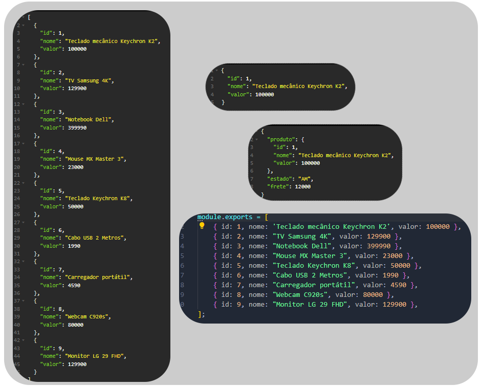

# API | Simulador de frete

Simples projeto de simulador de frete para produtos registrados em um banco de dados. Permite listar todos os ***itens registrados***, função busca de ***item pelo id*** e o ***simulador do frete***, onde será exibido o produto juntamente com o local destino e o valor que será cobrado pela entrega.

<br>


## Como rodar

Para rodar o projeto localmente, você precisa:

- Instalar as dependências

```shell
npm install
```

- Iniciar o projeto com:

```shell
npm run dev
```

## Rotas usáveis 
```shell
http://localhost:3000/produtos
```
```shell
http://localhost:3000/produtos/1
```
```shell
http://localhost:3000/produtos/1/frete/69650000
```

## Tecnologias usadas
- Javascript
- Node.js
- Express.js
- JSON
